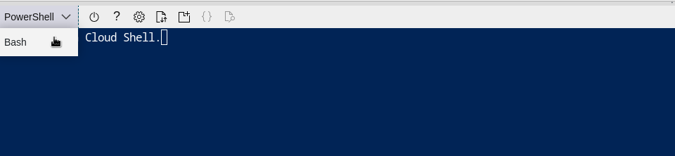

# ResizeMyAzureVM
A bash script that helps you resize your Azure VM to a new SKU

## Overview  
Traditionally and with older generations of Azure VMs, there was a local ephemeral storage that was attached (for example Standard_D2s_v3, Standard_E48_v3), but as Microsoft released new generations of VMs this ephemeral storage is no longer available for the same SKU type. While it is tempting to move to the newer generation of VM, Azure does not allow resizing a VM size that has a local temp disk to a VM size with no local temp disk. The only way for someone to resize in this case is to take a snapshot of the OS disk and recreate the VM using the new SKU type. I have created this simple bash script to automate the process and move any data disk that might be attached to the original VM.  

## Usage  

Update the following variables before running the VM  
**vmName**: Name of the VM you want to resize.  
**rgName**: Name of the resource group where the VM is located.  
**newSize**: The new SKU for the VM  
**tempvNet**: The vNet where the temporary NIC should be created  
**tempSubnet**: The subnet where the temporary NIC should be created  

### Example Usage  

You can pull the script from where you want to run it, for example you can also use the Azure Cloud Shell.  
Click the 'Cloud Shell' icon from the top right corner.  
  

  
Select Bash, instead of powershell.  
  

  
Clone the repo.  
```
$ git clone https://github.com/hazaq/ResizeMyAzureVM.git
```

Update the variable by using your favorit text editor.  
```
$ vim ResizeMyVM.sh
```

Run the script.  
```
$ sh ResizeMyVM.sh
```


## Process  
Below is the process the scripts follows.  
* The script starts the VM to collect some important information needed during the process, if the VM is already running it should still work.  
* Next, it collects the information related to the disk and NIC and stops the VM.  
* It creates a snapshot of the OS Disk and using the same snapshot creates a new OS disk.  
* Instead of recreating the NIC for the new VM, the script moves the old NIC to the new VM, so it can preserve the IP.  
* First, a temporary NIC is created and attached to the old VM, then the main NIC is detached from the old VM.  
* Finally, the script creates a new VM with the desired size using the disk created from the snapshot and with the main NIC.  
* After the VM starts, the script will move the data disk to the new VM.   
